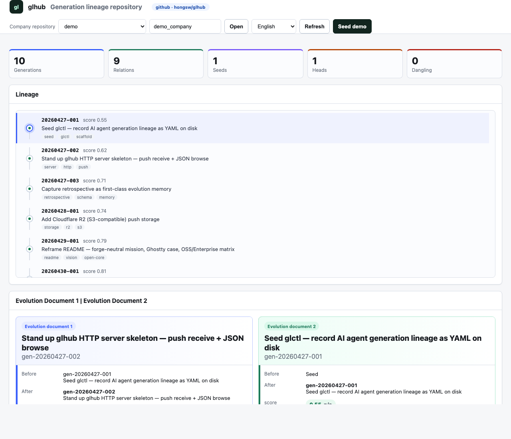
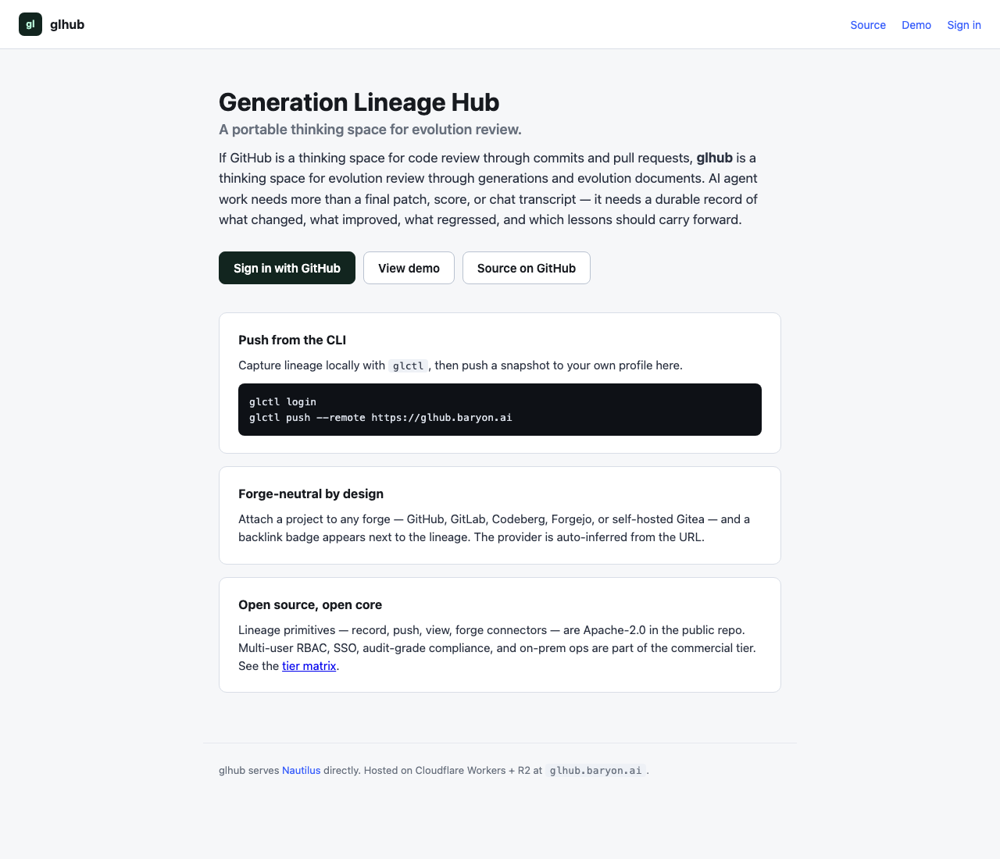
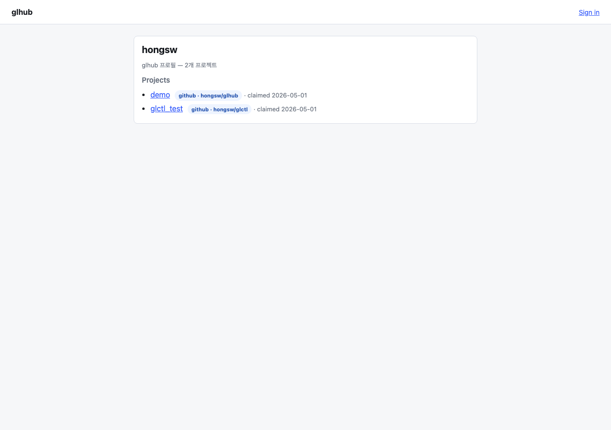
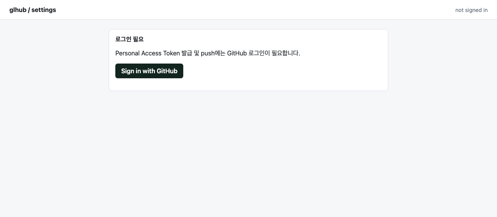

# glhub

[English](README.md) | [한국어](README.ko.md) | [中文](README.zh-CN.md) | [日本語](README.ja.md)

<p align="center">
  
</p>

<p align="center">
  <a href="https://glhub.baryon.ai/hongsw/demo">
    
  </a>
</p>

<sub>📄 Product / engineering grounding: [docs/PRD.md](docs/PRD.md) · [docs/SPEC.md](docs/SPEC.md). The landing page at <a href="https://glhub.baryon.ai/">glhub.baryon.ai</a> is the canonical product description (the PRD's North Star tracks it).</sub>

`glctl` is the local control tool for generation lineage. It exists because AI
agent work needs more than a final patch, score, or chat transcript. Each run
needs a durable record of where it came from, what changed, what improved, what
regressed, which lessons were learned, and which next generation should inherit
that memory. Without that lineage, agent work becomes a pile of disconnected
outputs instead of an auditable evolution process.

`glctl` records that process locally as generation history. It gives teams a
Git-like way to initialize a lineage store, create new generations, inspect
parents and children, validate repository health, render a graph, and push a
snapshot when the work is ready to be shared.

Nautilus is the meta-loop and system-of-record for AI agent work. Paperclip is
one frontend, a control plane / board UI; other frontends are possible. `glctl`
and `glhub` serve Nautilus directly, so they do not depend on any single
frontend.

`glhub` is what comes after local lineage becomes shared memory. If GitHub is a
thinking space for code review through commits and pull requests, glhub is a
thinking space for evolution review through generations and evolution
documents. It receives the history recorded by `glctl`, stores it, and presents
it as a browsable evolution workspace.

## Why glctl and glhub Exist

Code is easy to mirror. The work around the code is not.

### Background: Ghostty leaving GitHub

Ghostty's decision to reduce its GitHub dependency is a direct background case
for glhub. The important lesson is not "GitHub bad" or "everyone should migrate
today." The lesson is that even when Git itself is distributed, real software
delivery depends on centralized layers above Git: issues, pull requests, review
queues, Actions, status pages, account policy, and project-specific workflow
state.

When those layers degrade, the team may still have the repository, but the work
cannot move normally. A project can keep a read-only mirror, migrate code, or add
another remote, but the surrounding memory of the project is much harder to move
cleanly.

See: [Ghostty is leaving GitHub](https://news.hada.io/topic?id=28993).

### The project memory problem

That distinction shows up every time teams try to leave a central forge or
survive an outage. A repository clone can preserve commits, but it does not
automatically preserve the operating memory around the project: tickets, pull
requests, closed decisions, links that point into the old platform, CI behavior,
maintainer permissions, branch rules, and the history of why a change happened.
Those records are the difference between having the files and understanding the
work.

The emotional weight of that move matters too. Long-lived developer tools become
places where maintainers learn, collaborate, build habits, and accumulate trust.
When a critical work platform starts blocking review and release work often
enough, teams do not just lose uptime; they lose confidence that their project
memory and delivery process are under their control.

Agent-generated work has the same problem, only faster. An AI run may leave a
patch, a report, or a score, but the durable asset is the lineage around it:
which generation it came from, what changed, what improved, what regressed,
which rules were learned, which cases changed the decision, and what should be
tried next.

glhub exists so that agent work is not trapped inside one chat session, one
vendor UI, one CI log, or one orchestrator database. It gives AI-native teams a
portable repository for the reasoning trail around generated work.

The default deployment model should therefore connect glhub to the forge a team
already trusts:

- **GitLab OSS + glhub** for teams that want self-hosted source control,
  issues, merge requests, CI, and agent lineage under their own control.
- **Codeberg / Forgejo + glhub** for teams that want a FOSS forge, or a hosted
  Forgejo instance, while keeping AI lineage portable across forge providers.
- **GitHub + glhub** for teams that want to keep GitHub as the collaboration
  surface while storing AI-generated lineage, evaluations, and evolution memory
  in a separate portable system.

glhub should not require teams to abandon their forge on day one. It should make
the AI work around that forge portable first, then let teams decide whether to
stay on GitHub, run GitLab, use Codeberg, self-host Forgejo, or move elsewhere.

This need is well summarized by the discussion around a GitHub outage on
GeekNews and by Ghostty's move away from GitHub: mirroring code is the small
part; the hard part is preserving the project memory and workflow state around
the code.

## What's OSS, What's Enterprise

glhub follows an open-core model. The lineage primitives — record, push, view,
forge connectors — are fully open-source under Apache-2.0. Multi-user operation,
identity, audit-grade compliance, and on-prem ops live in a separate commercial
tier (Sentry-style: separate private repo plugged in via extension points, not
GitLab-style `ee/` source-available subdirectory).

| Capability | OSS (this repo) | Cloud (paid hosted) | Enterprise (paid + on-prem) |
|---|---|---|---|
| Generation lineage record + `glctl push` | ✅ | ✅ | ✅ |
| Local single-dev viewer (this server) | ✅ | ✅ | ✅ |
| Forge connectors (GitLab / Codeberg-Forgejo / GitHub) | ✅ basic | ✅ extended | ✅ extended + custom |
| Multi-user RBAC | — | ✅ | ✅ |
| SSO (SAML / SCIM / OIDC) | — | ✅ | ✅ |
| Hosted ops (backup, scaling, SLA) | self-host yourself | ✅ | — |
| Immutable audit log (1y+ retention) | — | partial | ✅ full |
| Signed audit pack (cryptographic provenance) | — | — | ✅ |
| Policy DSL + enforcement gate | — | — | ✅ |
| Compliance evidence packs (SOC2 / EU AI Act / NIST AI RMF / HIPAA / ISO 42001) | — | — | ✅ |
| Multi-tenancy + geo-replication | — | ✅ | ✅ |
| Air-gapped / on-prem package | self-build | — | ✅ supported |
| Org-level dashboards (cost / decisions / drift) | — | basic | ✅ full |
| Tamper-evident hash chain (Merkle per company) | — | — | ✅ |
| HSM-backed signing keys | — | — | ✅ |
| White-label (custom domain / branding) | — | — | ✅ |

OSS users do not need anything from the commercial tiers to ship a working
deployment — single-team, self-hosted, full lineage and viewer is the OSS
path. Cloud and Enterprise add the things multi-team regulated buyers
typically check before signing: identity, audit at compliance grade, policy
enforcement, on-prem support.

If you're a regulated buyer and one of the Enterprise rows is the wall you're
hitting, please open an issue tagged `enterprise-inquiry` or reach out through
the contact path in this repo's profile.

## What glhub Shows

The web view is intentionally centered on comparison:

```text
Evolution document 1 | Evolution document 2
```

When a generation is selected, glhub compares:

```text
parent generation | selected generation
```

Each side shows:

- title and generation id
- before and after context
- score and score delta
- tags
- why the evolution happened
- do-not rules
- do rules
- skills created or strengthened
- bugs fixed
- cases that changed the decision
- gains
- losses and tradeoffs

This is the core product idea: the important artifact is not raw JSON. The
important artifact is the reasoning trail that explains how one generation
became the next.

## Current UX

The page order is:

1. Header
   - company repository selector
   - manual company id input
   - language selector
   - refresh
   - seed demo
2. Metrics
3. Lineage graph
4. Full-width side-by-side evolution documents
5. Comment / edit composer

The web view supports:

- English / Korean UI labels
- known demo/system content translated by the client
- color-coded document identity
  - evolution document 1: blue
  - evolution document 2: green
- semantic status colors
  - positive/up: green
  - negative/down: red
  - warning/intermediate: amber
  - neutral structure: gray

Comments and edit proposals are saved as child generations. glhub does not
overwrite the original generation document, so the lineage remains auditable.

## Hosted Endpoint

A live, hosted glhub instance runs at:

```text
https://glhub.baryon.ai
```

<p align="center">
  <a href="https://glhub.baryon.ai/">
    
  </a>
  <br>
  <em>Public landing at <code>/</code> — what signed-out visitors see.</em>
</p>

<p align="center">
  <a href="https://glhub.baryon.ai/hongsw">
    
  </a>
  <br>
  <em>Owner profile at <code>/{owner}</code> — projects with forge backlink badges.</em>
</p>

This deployment is a Cloudflare Worker that serves only the *push receive +
viewer* surface. It accepts push snapshots through `POST /api/push` (Bearer
token required) and serves the same evolution viewer for any project that has
been pushed. Mutating endpoints (`seed-demo`, `generations`, `comment`) return
`501` on the hosted endpoint and require self-host.

URL structure:

```text
/                                    # Sign-in gate (redirects to GitHub OAuth)
/{owner}                             # Public profile page — projects + forge badges
/{owner}/{project_id}                # Public viewer for a pushed project
/settings                            # Personal Access Token management (login required)
/login/cli                           # Loopback OAuth flow for `glctl login`
/auth/github/{login,callback,logout}
/webhooks/github                     # HMAC-verified webhook receiver
/api/health                          # Reports auth + webhook status
/api/me, /api/tokens
/api/companies, /api/pushes/:c/latest
/api/repos/:c/{status,list,lineage,show,evolution,forge-link}
```

Auth model:

- **Read** (GET endpoints, viewer, profile) — public.
- **Push** (`POST /api/push`) — requires `Authorization: Bearer glhub_pat_…`.
  First push to a `company_id` claims ownership; later pushes from other users
  are rejected with `403`.
- **Forge link** (`POST /api/repos/:c/forge-link`) — owner only.
- **Webhook** — HMAC-SHA256 signature required (`X-Hub-Signature-256`).

<p align="center">
  <a href="https://glhub.baryon.ai/settings">
    
  </a>
  <br>
  <em><code>/settings</code> — sign in with GitHub to issue and manage Personal Access Tokens.</em>
</p>

Self-host follows a different model: full feature, no auth boundary, and
`glctl` is invoked directly as a subprocess.

## Run (self-host)

From the repository root:

```sh
pnpm --filter @paperclipai/glhub build
node glhub/dist/index.js
```

Open:

```text
http://127.0.0.1:3201
```

Optional environment:

```sh
GLHUB_HOST=127.0.0.1
GLHUB_PORT=3201
GLCTL_PATH=/abs/path/to/glctl
GLCTL_DATA_DIR=/abs/path/to/data/glctl
GLHUB_DATA_DIR=/abs/path/to/data/glhub
```

If `GLCTL_PATH` is not set, glhub uses:

```text
glctl/target/release/glctl
```

when present, otherwise `glctl` from `PATH`.

## Seed Demo

The UI has a **Seed demo** button.

It creates a small demo lineage under the selected company id:

```text
gen-...-001 -> gen-...-002
```

You can also seed through the API:

```sh
curl -X POST http://127.0.0.1:3201/api/repos/demo_company/seed-demo
```

## API

### Health

```http
GET /api/health
```

Response:

```json
{
  "ok": true,
  "service": "glhub",
  "glctl_path": "/abs/path/to/glctl",
  "data_dir": "/abs/path/to/data/glctl",
  "push_storage": "local",
  "push_prefix": "/abs/path/to/data/glhub"
}
```

`push_storage` is `r2` when R2 is configured, otherwise `local`.

### Companies

```http
GET /api/companies
```

Returns company ids discovered under:

```text
GLCTL_DATA_DIR/companies/
```

### Repository Summary

```http
GET /api/repos/:companyId/status
```

Calls:

```sh
glctl status --json
```

### List Generations

```http
GET /api/repos/:companyId/list
```

Calls:

```sh
glctl list --json
```

### Lineage

```http
GET /api/repos/:companyId/lineage
```

Calls:

```sh
glctl lineage --json
```

### Show Generation

```http
GET /api/repos/:companyId/show/:generationId
```

Calls:

```sh
glctl show :generationId --json
```

### Evolution Document

```http
GET /api/repos/:companyId/evolution/:generationId
```

Builds a readable evolution document from:

- current generation
- parent generation
- lineage children
- score delta
- gains/losses
- retrospective fields
- config patches

Response shape:

```json
{
  "id": "gen-20260427-003",
  "title": "Capture retrospective as first-class evolution memory",
  "before": {
    "id": "gen-20260427-002",
    "soul": "Improve lineage visibility for judges",
    "score": 0.81,
    "success": true,
    "tags": ["demo", "glhub"]
  },
  "transition": {
    "relation": "evolved_from",
    "score_delta": 0.08,
    "gains": [],
    "losses": [],
    "note": "",
    "retrospective": {
      "do_not": [],
      "do": [],
      "skills": [],
      "bugs_fixed": [],
      "cases": []
    },
    "config_patches": []
  },
  "after": {
    "id": "gen-20260427-003",
    "soul": "Capture retrospective as first-class evolution memory",
    "score": 0.89,
    "success": true,
    "tags": ["retrospective", "glhub"],
    "created_at": "2026-04-27T17:55:03Z"
  },
  "next": []
}
```

### Comment / Edit Proposal

```http
POST /api/repos/:companyId/comment/:generationId
```

Body:

```json
{
  "kind": "comment",
  "text": "This decision should mention the deployment risk."
}
```

or:

```json
{
  "kind": "edit",
  "text": "Add stale process detection as a required invariant."
}
```

This creates a child generation:

- `kind=comment` -> tags: `comment`, `glhub-note`
- `kind=edit` -> tags: `edit`, `glhub-note`; the text is also recorded as a `do` retrospective item

### Forge Link

```http
GET  /api/repos/:companyId/forge-link
POST /api/repos/:companyId/forge-link
```

Public read. Owner-only write (Bearer token from the same user that owns the
project, or active session). Body for write:

```json
{ "url": "https://github.com/owner/repo" }
```

Provider is auto-inferred from the URL host (`github`, `gitlab`, `codeberg`,
`forgejo`, `bitbucket`, or `custom`). Stored response shape:

```json
{
  "schema_version": "glhub-forge-link/v1",
  "company_id": "demo",
  "provider": "github",
  "repo": "owner/repo",
  "url": "https://github.com/owner/repo",
  "set_by_user_id": "...",
  "set_by_login": "...",
  "set_at": "..."
}
```

The viewer fetches this on load and renders a badge next to the brand. The
profile page renders the same badge per project.

### Webhook (hosted)

```http
POST /webhooks/github
```

Receives GitHub App webhook events. Verifies `X-Hub-Signature-256` HMAC-SHA256
against the configured `GITHUB_WEBHOOK_SECRET`. Stores the event metadata and
full payload to:

```text
glhub/webhooks/{event}/{delivery_id}.json
```

Returns `202` on success, `401` on signature mismatch, `503` if no webhook
secret is configured.

### Push Snapshot

```http
POST /api/push
```

Hosted endpoint requires `Authorization: Bearer glhub_pat_…`. First push to a
`company_id` claims ownership; subsequent pushes from other tokens get `403`.
Self-host accepts unauthenticated push.

Used by:

```sh
glctl push --remote https://glhub.baryon.ai     # hosted, needs `glctl login`
glctl push --remote http://127.0.0.1:3201       # self-host, no auth
```

Payload:

```json
{
  "schema_version": "glhub-push/v1",
  "company_id": "demo_company",
  "pushed_at": "2026-04-27T18:23:15Z",
  "status": {
    "company_id": "demo_company",
    "generation_count": 3,
    "relation_count": 2,
    "seed_count": 1,
    "head_count": 1,
    "latest_generation_id": "gen-...",
    "best_generation_id": "gen-..."
  },
  "generations": [],
  "relations": []
}
```

Response:

```json
{
  "ok": true,
  "company_id": "demo_company",
  "generations": 3,
  "relations": 2,
  "storage": {
    "driver": "local",
    "key": ".../data/glhub/pushes/demo_company/....json",
    "latest_key": ".../data/glhub/pushes/demo_company/latest.json"
  }
}
```

## R2 Storage

glhub supports Cloudflare R2 through the S3-compatible API.

Set:

```sh
GLHUB_R2_BUCKET=...
GLHUB_R2_ENDPOINT=...
GLHUB_R2_ACCESS_KEY_ID=...
GLHUB_R2_SECRET_ACCESS_KEY=...
GLHUB_R2_PREFIX=glhub
```

Then restart glhub.

When configured, `/api/push` writes:

```text
{prefix}/pushes/{company_id}/{push_id}.json
{prefix}/pushes/{company_id}/latest.json
```

If R2 is not configured, glhub writes the same snapshot structure locally:

```text
data/glhub/pushes/{company_id}/{push_id}.json
data/glhub/pushes/{company_id}/latest.json
```

## glctl Push

Build `glctl` first:

```sh
cd glctl
cargo build --release
```

### Self-host push

```sh
GLCTL_COMPANY_ID=demo_company \
GLCTL_DATA_DIR="$HOME/.glctl/data" \
./target/release/glctl push --remote http://127.0.0.1:3201
```

### Hosted push (requires login)

Authenticate once via interactive browser flow:

```sh
glctl login
# Opens browser → GitHub OAuth → token issued and saved to ~/.glctl/config
```

Headless / CI alternative: generate a token at
`https://glhub.baryon.ai/settings` and save it directly:

```sh
glctl auth --token glhub_pat_xxxxxxxxxxxxxxxxxxxxxxxx
```

Then push:

```sh
GLCTL_COMPANY_ID=demo_company \
GLCTL_DATA_DIR="$HOME/.glctl/data" \
glctl push --remote https://glhub.baryon.ai
```

`glctl push` uses `https://glhub.baryon.ai` by default when neither `--remote`
nor `GLHUB_URL` is set. Token resolution: `--token` > `GLHUB_TOKEN` > `~/.glctl/config`.

### Connecting a forge

After your first push to a `company_id`, attach a forge URL so the viewer and
profile page show a backlink badge. Provider (github / gitlab / codeberg /
forgejo / bitbucket) is auto-inferred from the URL:

```sh
TOKEN=$(jq -r .token ~/.glctl/config)
curl -X POST https://glhub.baryon.ai/api/repos/demo_company/forge-link \
  -H "Authorization: Bearer $TOKEN" \
  -H "Content-Type: application/json" \
  -d '{"url":"https://github.com/your/repo"}'
```

## Verification

From the repository root:

```sh
pnpm --filter @paperclipai/glhub typecheck
pnpm --filter @paperclipai/glhub build
```

With glhub running:

```sh
curl http://127.0.0.1:3201/api/health
curl http://127.0.0.1:3201/api/repos/demo_company/status
curl http://127.0.0.1:3201/api/repos/demo_company/lineage
```

## Design Notes

glhub should not become a raw data browser.

The design priority is:

1. Show the before/after relationship immediately.
2. Preserve the reasoning trail.
3. Make retrospective memory visible.
4. Keep raw machine data behind the product experience.
5. Treat every comment or edit as new lineage, not mutation in place.

The core rule:

```text
Do not overwrite evolution memory. Add a new generation.
```

## Forge Integration Direction

glhub should integrate with existing forges instead of replacing them.

The first-class targets are:

1. **GitLab OSS + glhub**
   - self-hosted default path
   - read projects, issues, merge requests, pipelines, commit refs, and users
   - attach generation ids and evolution documents to merge requests or issues
   - keep lineage snapshots outside GitLab so the project memory can be moved or
     restored independently

2. **Codeberg / Forgejo + glhub**
   - FOSS forge path, with Codeberg as the hosted profile and Forgejo as the
     self-hosted profile
   - read repositories, issues, pull requests, comments, commits, releases, and
     users through the Forgejo/Gitea-compatible API
   - receive push, issue, pull request, and comment events through Forgejo
     webhooks
   - write back links to glhub evolution documents as issue or pull request
     comments
   - keep lineage independent from the Codeberg instance so projects can move
     between hosted Codeberg, self-hosted Forgejo, GitLab, or GitHub

3. **GitHub + glhub**
   - pragmatic adoption path for existing open source projects
   - read repositories, issues, pull requests, checks, Actions runs, comments,
     and commit refs
   - write back links to glhub evolution documents as PR comments, issue
     comments, or status/check annotations
   - preserve AI lineage even when GitHub search, Actions, PR indexing, or UI
     state is degraded

The integration contract should be forge-neutral:

```text
Forge event -> glhub generation context -> agent run/evaluation -> glhub
evolution document -> forge backlink
```

For Codeberg, this should be implemented as a `forgejo` connector with
configurable `base_url` and `api_root` values, not as a Codeberg-only adapter.
That keeps the same integration usable for Codeberg, self-hosted Forgejo, and
compatible Gitea instances.

The forge remains the place where humans already collaborate. glhub becomes the
portable memory layer for agent-generated work around that collaboration.
